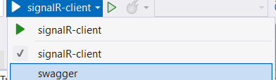

# Ki-Reiseplaner

Für das Lösen der Aufgabe werden folgende Dinge benötigt:

- Eine MySQL-Datenbank und die Zugangsinformationen für den ConnectionString
- Einen Api-Key für Gemini
- Die Vorlesungsfolien von Applikationsintegration sind sehr hilfreich
- VisualStudio 2022 wie wir es in der Vorlesung verwendet haben
- Eine Internetanbindung für die Kommunikation mit Gemini

Entwickelt werden soll eine Applikation, welche mittels REST-Schnittstelle Reiseziele erfassen, löschen kann. Auch soll eine Reise geplant werden können. Die Applikation verwendet eine Anbindung zu Gemini, um Daten generieren zu können.

## Domänen Modelle

Reiseziele:

``` JSON
{
  "Id": int
  "City": string //Name der Stadt die das Reiseziel ist
  "Landmarks": string //Beschreibung der wichtigsten Sehenswürdigkeiten als String.
                      //Dieser Teil soll automatisch generiert werden
}
```

Reisen:

```JSON
{
  "Id": int
  "Cities": [int] //Ein Array mit Ids von Reisezielen
  "Schedule": string //Der Reiseplan. Dieser soll auch Ki-Generiert werden
}
```

## Schnittstellen

- Erstellen und Löschen von Reisezielen und Reisen
  - Schnittstellen zum Ändern von Reisen bzw. Reisezielen müssen nicht implementiert werden (ich halte aber niemanden davon ab)
  - Beim Erstellen von Reisezielen kann beim Request die Beschreibung der Sehenswürdigkeiten (Landmarks) mitgegeben werden. Falls diese nicht mitgegeben wird, soll diese vom Ki-Service generiert werden.
  - Das Gleiche gilt für die Reise. Der Reiseplan (Schedule) kann mitgegeben werden. Falls dieser nicht mitgegeben wird, soll dieser vom Ki-Service generiert werden
  - Es wird angenommen, dass der User beim Erstellen einer Reise nur Gültige Ids von Reisezielen angibt. Als Zusatzaufgabe kann eine Prüfung der Ids implementiert werden
- Eine Auflistung mit allen Reisezielen (Nur die Id und der Name der Stadt soll in der Liste sein)
- Eine Auflistung mit allen Reisen (Liste mit kompletten Datensätzen)
- Ein einzelnes Reiseziel
  - Nur der Name der Stadt und die Beschreibung der Sehenswürdigkeiten wird zurückgegeben
- Eine einzelne Reise
  - Nur die Auflistung der besuchten Städte (Ids) und der Reiseplan werden zurückgegeben
  - Zusatzaufgabe: Auch die Namen der Städte werden als Array zurückgegeben

Jedes Mal, wenn eine neue Reise erstellt wird, sollen die Clients mittels SignalR den Reiseplan der Reise übermittelt bekommen.

## Aufgaben

- Domänenmodelle korrekt implementieren
- Design der Schnittstellen damit die API als Restful bezeichnet werden kann
- Erstellung einer Tabelle im Excel mit der Übersicht über die Schnittstellen (Methode, URL, Zusatzaufgabe: Response Codes)
- Sinnvolle Statuscode bei der Rückgabe bei nicht vorhandenen Ressourcen oder Formgebrechen im Request
- Implementierung der Datenbankanbindung
- Die Schnittstellen sollen wie oben beschrieben funktionieren
- Registrieren der Services (Gemini und SignalR) und Repositories (Reiseziele und Reisen)
- Design für jede Rückgabe die nicht ein komplettes Domänenmodell beinhaltet ein eigenes Data Transfer Model
- Implementierung der Anfrage an Gemini in der Klasse TravelGenerationService.cs. Der Requestbody wurde bereits designt. Das Format einer Response kann aus dem Anhang entnommen werden.
- Vergiss nicht in der Methode GernerateTravelReport() des TravelGenerationService die Kommentare durch den Zugriff auf die Properties des Domänenmodells zu ersetzen!
- Senden einer neu generierten Reise per Signal R und anzeige dieser im Front-End (Schöne Formatierung kann ignoriert werden)
- Alle auch bereits erstellten Dateien prüfen, ob eventuell noch Code ergänzt werden muss!

## Hinweise

- Es wird angenommen, dass der User nur sinnvolle Datensätze anlegt, d. h. gültige Städtenamen und sinnvolle Beschreibung der Sehenswürdigkeiten bzw. Reisen
- Unten sind beide Arten von Anfragen an Gemini, muss aber nur noch das Format für den Response eingebaut werden (ist für beide arten von Anfragen das selbe!)
- Es kann über den grünen Pfeil entweder Swagger oder der SignalR-client gestartet werden (siehe Screenshot). Im SignalR-Client gibt es auch einen Link zu Swagger, so dass beides nebeneinander geöffnet werden kann!



## Anhang

### Beispiel Gemini Request/Response für die Generierung von Sehenswürdigkeiten

Beispielrequest

```JSON  
{
  "contents": [
    {
      "parts": [
        {
         "text": "Bitte beschreibe die wichtigsten Sehenswürdigkeiten der folgenden Stadt: Wien"
        }
      ]
    }
  ]
}
```

Beispielresponse  

```JSON
  {
  "candidates": [
      {
      "content": {
        "parts": [
          {
           "text": "Wien ist eine Stadt voller Geschichte, Kultur und beeindruckender Architektur. Hier sind einige der wichtigsten Sehenswürdigkeiten,[...] Planen Sie genügend Zeit ein, um diese faszinierende Stadt zu erkunden!\\n"
          }
        ],
        "role": "model"
      },
      "finishReason": "STOP",
      "avgLogprobs": -0.24194933020550272
    }
  ],
  "usageMetadata": {
    "promptTokenCount": 12,
    "candidatesTokenCount": 897,
    "totalTokenCount": 909,
    "promptTokensDetails": [
      {
        "modality": "TEXT",
        "tokenCount": 12
      }
    ],

    "candidatesTokensDetails": [
      {
        "modality": "TEXT",
        "tokenCount": 897
      }
    ]
  },
  "modelVersion": "gemini-2.0-flash"
}
```

### Beispiel Gemini Request/Response für die Generierung einer Reise

Request

```JSON
{
  "contents": [
    {
      "parts": [
        {
        "text": "Generiere bitte eine Rundreise durch folgende Orte: \\n Wien: \\nWien ist eine Stadt\[...\] Stadt zu erkunden!\\nBerlin:\\n Berlin ist eine Stadt \[...\] definitiv eine Reise wert!\\nMoskau:\\nMoskau, die pulsierende Hauptstadt Russlands, ist\[...\] mit der Metro erkundet!\\n"
        }
      ]
    }
  ]
}
```

Response

```JSON
{
  "candidates": [
    {
      "content": {
        "parts": [
          {
            "text": "Okay, hier ist ein möglicher Rundreiseplan, der Wien, Berlin und Moskau in einer logischen Reihenfolge verbindet. Ich habe eine Reisedauer von ca. 14 Tagen angenommen, die natürlich anpassbar ist. Da Moskau weiter entfernt ist, habe ich dort etwas mehr Zeit eingeplant.\\n\\n\*\*Gesamtdauer:\*\* 14 Tage (anpassbar)\\n\\n\*\*Schwerpunkt:\*\* Kultur, Geschichte, Architektur\\n\\n\*\*Transport:\*\* Flugzeug (zwischen den Städten), öffentliche Verkehrsmittel in den Städten.\\n\\n\*\*Reihenfolge:\*\* Wien - Berlin - Moskau (Dies ist eine von vielen Möglichkeiten. Man könnte auch mit Moskau beginnen und dann nach Westen reisen).\\n\\n\*\*Tag 1-3: Wien (3 Tage)\*\*\\n\\n\* \*\*Tag 1:\*\*\\n \* Ankunft in Wien, Transfer zum Hotel.\\n \* Spaziergang durch das historische Zentrum (Stephansdom, Graben, Kohlmarkt, Michaelerplatz).\\n \* Abendessen in einem traditionellen Wiener Restaurant.\\n\* \*\*Tag 2:\*\*\\n \* Besuch von Schloss Schönbrunn (Schloss, Park, Gloriette, Tiergarten).\\n \* Nachmittag: MuseumsQuartier (Leopold Museum oder MUMOK).\\n \* Abend: Besuch eines Heurigen (Weingarten) am Stadtrand.\\n\* \*\*Tag 3:\*\*\\n \* Vormittag: Hofburg (Kaiserappartements, Sisi Museum, Silberkammer), Spanische Hofreitschule (Vorführung oder Stallführung).\\n \* Nachmittag: Belvedere (Oberes und Unteres Belvedere, Garten).\\n \* Abend: Wiener Staatsoper (Führung oder Aufführung).\\n\\n\*\*Tag 4: Reise von Wien nach Berlin\*\*\\n\\n\* Vormittag: Ausschlafen und eventuell ein letztes Wiener Frühstück. Besuch des Naschmarktes für Souvenirs oder einen Imbiss.\\n\* Nachmittag: Transfer zum Flughafen Wien (VIE), Flug nach Berlin (BER).\\n\* Abend: Ankunft in Berlin, Transfer zum Hotel. Erster Spaziergang durch die Gegend um das Hotel.\\n\\n\*\*Tag 5-7: Berlin (3 Tage)\*\*\\n\\n\* \*\*Tag 5:\*\*\\n \* Vormittag: Brandenburger Tor, Reichstagsgebäude (vorherige Anmeldung erforderlich!).\\n \* Nachmittag: Gedenkstätte Berliner Mauer (Bernauer Straße), East Side Gallery.\\n \* Abend: Potsdamer Platz und Sony Center.\\n\* \*\*Tag 6:\*\*\\n \* Vormittag: Museumsinsel (Pergamonmuseum, Neues Museum).\\n \* Nachmittag: DDR Museum oder Deutsches Historisches Museum.\\n \* Abend: Besuch des Gendarmenmarkts mit Abendessen in einem der Restaurants.\\n\* \*\*Tag 7:\*\*\\n \* Vormittag: Checkpoint Charlie, Holocaust-Mahnmal.\\n \* Nachmittag: Schloss Charlottenburg und die dazugehörigen Gärten.\\n \* Abend: Besuch des Hackeschen Marktes oder Nikolaiviertels.\\n\\n\*\*Tag 8: Reise von Berlin nach Moskau\*\*\\n\\n\* Vormittag: Ausschlafen und entspanntes Frühstück. Möglichkeit für einen Besuch des Flohmarktes am Mauerpark (Sonntags).\\n\* Nachmittag: Transfer zum Flughafen Berlin (BER), Flug nach Moskau (SVO, DME oder VKO).\\n\* Abend: Ankunft in Moskau, Transfer zum Hotel.\\n\\n\*\*Tag 9-12: Moskau (4 Tage)\*\*\\n\\n\* \*\*Tag 9:\*\*\\n \* Vormittag: Roter Platz, Basilius-Kathedrale.\\n \* Nachmittag: Kreml (Kathedralen, Paläste, Museen – Rüstkammer).\\n \* Abend: Besuch des GUM-Kaufhauses.\\n\* \*\*Tag 10:\*\*\\n \* Vormittag: Tretjakow-Galerie (Alte oder Neue).\\n \* Nachmittag: Christ-Erlöser-Kathedrale.\\n \* Abend: Besuch einer Metro-Stationen-Tour.\\n\* \*\*Tag 11:\*\*\\n \* Vormittag: Nowodewitschi-Kloster und Friedhof.\\n \* Nachmittag: Sparrow Hills (Sperlingsberge) und Moskauer Staatliche Universität (MGU).\\n \* Abend: Besuch des Bolschoi-Theaters (wenn möglich).\\n\* \*\*Tag 12:\*\*\\n \* Vormittag: Kolomenskoje oder Zarizyno (Palast- und Parkkomplex).\\n \* Nachmittag: VDNKh (Ausstellung der Errungenschaften der Volkswirtschaft).\\n \* Abend: Spaziergang auf der Arbat-Straße.\\n\\n\*\*Tag 13: Optionaler Zusatztag in Moskau oder Reisevorbereitung\*\*\\n\\n\* Nutze den Tag, um eine weitere Sehenswürdigkeit zu besuchen, die dir besonders gut gefällt, Souvenirs zu kaufen oder einfach nur zu entspannen und die Stadt zu genießen. Alternativ kannst du dich auf deine Abreise vorbereiten.\\n\\n\*\*Tag 14: Abreise aus Moskau\*\*\\n\\n\* Transfer zum Flughafen Moskau (SVO, DME oder VKO) für deinen Rückflug.\\n\\n\*\*Anmerkungen:\*\*\\n\\n\* \*\*Flüge:\*\* Die Flugkosten und Flugzeiten können je nach Jahreszeit und Buchungszeitpunkt variieren. Es empfiehlt sich, Flüge im Voraus zu buchen.\\n\* \*\*Visa:\*\* Überprüfe die Visabestimmungen für Russland, da diese je nach deiner Nationalität unterschiedlich sein können.\\n\* \*\*Unterkünfte:\*\* Buche Unterkünfte im Voraus, besonders in der Hochsaison. Die Preise variieren je nach Lage und Komfort.\\n\* \*\*Öffentliche Verkehrsmittel:\*\* Nutze die effizienten öffentlichen Verkehrsmittel in allen drei Städten. In Wien und Berlin sind dies U-Bahn, Straßenbahn und Bus, in Moskau ist die Metro das wichtigste Verkehrsmittel.\\n\* \*\*Sprache:\*\* In Moskau sind Englischkenntnisse weniger verbreitet als in Wien und Berlin. Es kann hilfreich sein, ein paar grundlegende russische Sätze zu lernen oder einen Übersetzer-App zu nutzen.\\n\* \*\*Flexibilität:\*\* Dies ist nur ein Vorschlag. Passe die Reiseroute an deine Interessen und dein Budget an.\\n\\nDiese Rundreise bietet einen guten Überblick über die wichtigsten Sehenswürdigkeiten von Wien, Berlin und Moskau. Viel Spaß bei der Planung und Reise!\\n"
          }
        ],
        "role": "model"
      },
      "finishReason": "STOP",
      "avgLogprobs": -0.24306018928612919
    }
  ],
  "usageMetadata": {
    "promptTokenCount": 2747,
    "candidatesTokenCount": 1345,
    "totalTokenCount": 4092,
    "promptTokensDetails": [
        {
          "modality": "TEXT",
          "tokenCount": 2747
        }
      ],
      "candidatesTokensDetails": [
      {
        "modality": "TEXT",
        "tokenCount": 1345
      }
    ]
  },
  "modelVersion": "gemini-2.0-flash"
}
```
